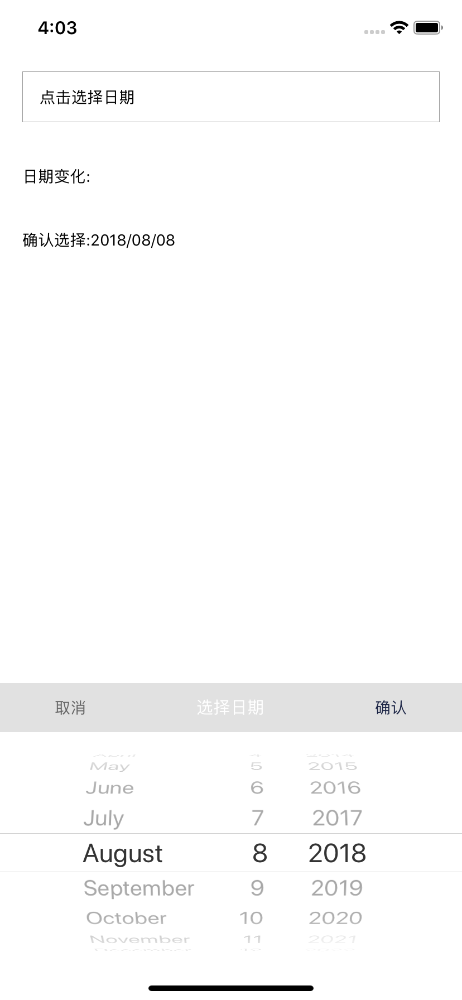

# react-native-date-picker
Lightweight date picker

- There is no other integration, and you can even take DatePicker.js out and use it directly.
- IOS use DatePickerIOS and Android use DatePickerAndroid


### Sample
```sh
$ cd Sample
$ npm install
$ react-native run-ios   // For ios
$ react-native run-android   // For Android
```

### Installation
`npm install react-native-simple-date-picker --save`

### Usage
```javascript
...
render() {
    return (
      <View>
        {...Other Element}
        <DatePicker ref={(ref)=>{ this.datePicker = ref; }}
            dateFormat={'yyyy/MM/dd'}
            date={new Date(2018, 7, 8)}
            minimumDate={new Date(2008, 7, 8)}
            maximumDate={new Date(2020, 7, 8)}
            onDatePicked={(selectedDate, selectedDateFormat)=>{
                this.setState({
                    pickedText: selectedDateFormat
                })
            }}
            onCanceled={()=>{

            }}
            // iOS only
            onDateChanged={(date, dateFormat)=>{
                this.setState({
                    changedText: dateFormat
                })
            }}
            title={'选择日期'}
            // Android only
            onError={(error)=>{
                const { message } = error;
            }}
        />
      </View>
    );
  }

whereUse() {
    this.datePicker.show();
}
...
```

### Properties

| Name | Type | Description | Default
| ------------ | ------------- | ------------ |------------ |
| `dateFormat` | String  | Current date format | yyyy-MM-dd
| `date` | Date  | The first pop-up date of default selection | new Date()
| `minimumDate` | Date  | Minimum optional range date | new Date()
| `maximumDate` | Date  | Maximum optional range date | new Date(3000, 1, 1)
| `onDatePicked` | Function  | Date confirmation selection | none 
| `onCanceled` | Function  | Cancel | none
| `onDateChanged` | Function | Date change(iOS only) | none
| `title` | String | Title(iOS only) | none
| `onError` | Function | Error occurred(Android only) | none
